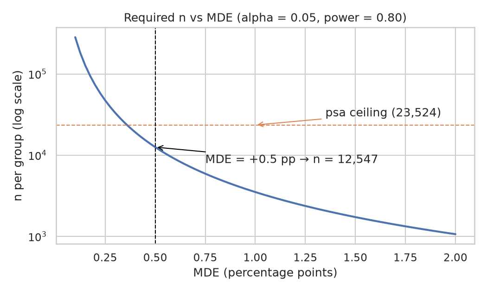
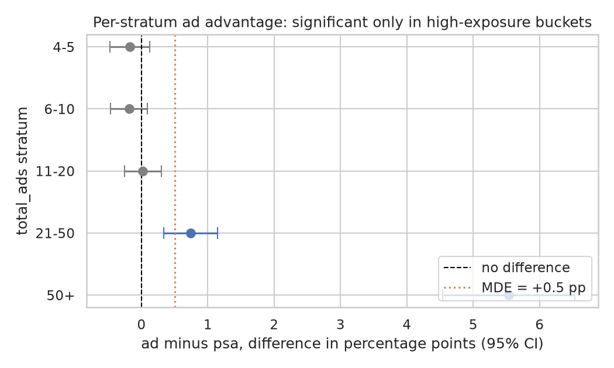

# Marketing A/B Experiment — Статистический анализ

Полный воспроизводимый цикл A/B-тестирования на маркетинговых данных
588K пользователей: планирование мощности (statistical power),
pre-registration, проверка гипотез и оценка бизнес-значимости.

[English version](README.md)


> **TL;DR — вердикт: не внедрять.** Пулированное преимущество ad (+0.77 п.п.,
> p = 1.7e-13) статистически значимо, **но не однородно**: стратификация по
> `total_ads` (ноутбук 06) показывает, что эффект сконцентрирован у
> пользователей с высоким показом и, вероятно, является конфаундером.
> Рекомендация: провести рандомизированный тест перед реальным запуском.
> Полное обоснование: `reports/05_executive_summary.html`.

## Содержание

- [Введение](#введение)
- [Технологический стек](#технологический-стек)
- [Структура проекта](#структура-проекта)
- [Быстрый старт](#быстрый-старт)
- [Установка и использование](#установка-и-использование)
- [Данные](#данные)
- [Разведочный анализ данных (EDA)](#разведочный-анализ-данных-eda)
- [Pre-registration](#pre-registration)
- [Методология](#методология)
- [Результаты](#результаты)
- [Бизнес-значимость](#бизнес-значимость)
- [Тестирование](#тестирование)
- [Ограничения](#ограничения)
- [Рекомендации](#рекомендации)
- [Поддержка](#поддержка)
- [Вклад в проект](#вклад-в-проект)
- [Лицензия](#лицензия)
- [Благодарности](#благодарности)

## Введение

Проект имитирует рабочий день продуктового аналитика: оценивается, меняет
ли рекламная кампания (группа `ad`) конверсию в покупку по сравнению с
социальной рекламой (группа `psa`, контроль). Анализ следует золотым
стандартам анализа данных: целостность данных проверяется до любых выводов
(data integrity first), план теста фиксируется до взгляда на результаты
(pre-registration), а решение требует одновременной статистической и
практической значимости.

Основные вклады:

- Заранее зафиксированное правило решения (MDE, alpha, мощность) — никакая
  часть анализа не подгоняется под найденный результат.
- Закрытые формулы размера выборки, power-кривая и анализ чувствительности
  к MDE, реализованные как тестируемые функции в `src/`.
- Двусторонний z-тест для пропорций с доверительным интервалом Wald,
  сверенный с `statsmodels`.
- Оценка бизнес-эффекта с честными границами (наблюдательная когорта,
  нет данных о затратах, *подтверждённый* конфаундер через стратификацию по
  `total_ads` в ноутбуке 06).

В «рабочем дне» каждая задача аналитика отображается на проверяемый артефакт:

| Задача | Где живёт |
| ------ | --------- |
| Проверка целостности данных (единица анализа, дубликаты, пропуски, диапазоны) | `src/eda.py`, ноутбук 01 |
| Планирование мощности и размера выборки *до* оценки данных | `src/inference.py`, ноутбук 02 |
| Pre-registration гипотез и MDE | `reports/pre_registration.md` |
| Подтверждающий тест гипотезы и доверительные интервалы | ноутбук 03 |
| Перевод в бизнес-значимость | ноутбук 04 |
| Робастность к конфаундеру (стратифицированная проверка) | ноутбук 06 |
| Коммуникация со стейкхолдерами (итоговое резюме) | `reports/05_executive_summary.html`, этот README |

Логика каждого этапа (зачем этот подход, ключевые термины с английскими
эквивалентами, подводные камни) задокументирована в `notes/`.

## Технологический стек

| Категория          | Технологии                                          |
| ------------------ | --------------------------------------------------- |
| Язык               | Python 3.12                                         |
| Статистика         | SciPy, statsmodels (сверка формул)                  |
| Обработка данных   | pandas, NumPy                                       |
| Визуализация       | Matplotlib, seaborn                                 |
| Ноутбуки           | Jupyter (воспроизводимая сборка через nbformat + nbclient) |
| Тестирование       | pytest                                              |
| Окружение          | uv / venv, `requirements.txt` с зафиксированными версиями |

## Структура проекта

```
├── src/                  Переиспользуемые тестируемые функции (eda, inference)
├── tests/                pytest-покрытие для src/
├── notebooks/            Этапы 01–06: EDA, план, тест, бизнес, резюме, робастность (сборка из build_*.py, выводы вшиты)
├── reports/              Pre-registration + итоговое резюме (HTML)
├── assets/               PNG-графики для README
├── notes/                Учебные заметки по этапам (русский язык)
├── data/                 Датасет (источник задокументирован; CSV не в git, 22 МБ)
├── README.md             Этот файл
└── requirements.txt      Зафиксированные зависимости
```

## Быстрый старт

**Вариант A: uv (рекомендуется)**

```bash
uv venv .venv
uv pip install --python .venv/bin/python -r requirements.txt
.venv/bin/python -m pytest tests/
```

**Вариант B: классические venv + pip**

```bash
python3 -m venv .venv
source .venv/bin/activate
pip install -r requirements.txt
pytest tests/
```

**Вариант C: изучить отчёт без установки**

Откройте `reports/05_executive_summary.html` в браузере — там полное решение
и воспроизводимые ключевые цифры.

## Установка и использование

Требования: Python 3.12, `uv` (или `pip`), датасет в `data/marketing_AB.csv`
(см. [Данные](#данные)).

Пересобрать и перезапустить все ноутбуки из тестируемых функций `src/`:

```bash
for f in notebooks/build_0*.py; do .venv/bin/python "$f"; done
```

Экспортировать итоговое резюме в отдельный HTML:

```bash
.venv/bin/python -m jupyter nbconvert --to html \
  --output-dir reports notebooks/05_executive_summary.ipynb
```

Открыть ноутбук интерактивно:

```bash
.venv/bin/python -m jupyter notebook notebooks/05_executive_summary.ipynb
```

## Данные

Датасет Marketing A/B Testing (Kaggle, faviovaz). Источник и инструкция по
повторной загрузке — в `data/README.md`.

| Характеристика                | Значение          |
| ----------------------------- | ----------------- |
| Строк                         | 588 101           |
| Уникальных пользователей      | 588 101 (дубликатов нет) |
| Пропусков                     | 0                 |
| Группы                        | ad = 564 577 (96%), psa = 23 524 (4%) |
| Конверсия (ad / psa)          | 2.55% / 1.79%     |
| `total_ads`                   | 1–2065 на пользователя |
| `most_ads_day` / `most_ads_hour` | все 7 дней, часы 0–23 |

Признаки: `user_id`, `test_group`, `converted` (0/1), `total_ads`,
`most_ads_day`, `most_ads_hour`.

Очистка: вычищать нечего — удаляется лишний индекс-столбец Kaggle и
`converted` приводится к целому 0/1 (`src/eda.py`).

## Разведочный анализ данных (EDA)

- Единица анализа (unit of analysis) — пользователь: каждая строка ровно
  один user id.
- Группы сильно несбалансированы (96/4); выборка psa (23 524) — «узкое
  горло» при планировании мощности.
- Наблюдаемая конверсия различается описательно (см. график) — выводы из
  одного EDA не делаются.


> [!NOTE]
> Разница 0.77 п.п. из EDA — описательный факт о выборке, а не заявление о
> значимости. Значимость решает pre-registered тест, который запускается
> только после фиксации плана.

## Pre-registration

Правило решения записано в `reports/pre_registration.md` на этапе
планирования, до анализа любых исходов; ничто в этом проекте не подогнано
под результаты.

> **Зарегистрированный план (выдержка):** H₀: p_ad = p_psa;
> H₁: p_ad ≠ p_psa (двусторонняя). α = 0.05, целевая мощность = 0.80,
> MDE = +0.5 п.п., базовая конверсия p_psa = 1.79%. Правило решения:
> внедрять только при p < 0.05 **и** эффекте не ниже MDE — одна
> статистическая значимость никогда не ведёт к внедрению.

Эксперимент был адекватно мощным *до* запуска анализа:

| Результат планирования              | Значение |
| ----------------------------------- | -------- |
| Требуемый n на группу при мощности 80% | 12 547 |
| Размер группы psa («узкое горло»)   | 23 524  |
| Достигнутая мощность на размере psa | 0.97     |


## Методология

Закрытая формула размера выборки на группу для зарегистрированного
двустороннего z-теста пропорций (параметры зафиксированы выше):

$$n = \left( \frac{z_{1-\alpha/2}\sqrt{2\bar{p}(1-\bar{p})} +
z_{1-\beta}\sqrt{p_0(1-p_0)+p_1(1-p_1)}}{p_1-p_0} \right)^2$$

где p1 = p0 + MDE, p̄ = (p0 + p1)/2.

Анализ чувствительности: для эффекта +0.1 п.п. понадобилось бы ~283K на
группу (недостижимо при текущем psa); +1 п.п. — лишь ~3.5K. Наблюдаемый
эффект уверенно попадает в разрешимый диапазон.



Тест — двухвыборочный z-тест пропорций с пулированной (pooled) дисперсией
под H0 и 95% доверительный интервал Wald для разности. Допущения
(независимость, n·p и n·(1−p) заметно больше 5 в обеих группах)
проверяются и фиксируются до результата.

## Результаты

| Показатель                     | Значение           |
| ------------------------------ | ------------------ |
| Конверсия, ad vs psa           | 2.55% vs 1.79%     |
| Разница, п.п.                  | +0.77              |
| Относительный прирост          | +43.1%             |
| z-статистика / p-value (двуст.) | 7.37 / 1.7e-13    |
| 95% CI для разности            | [+0.60, +0.94] п.п.|
| Доп. конверсии на всю базу (95% CI) | [3 500, 5 548] |

Решение **до** robustness-проверки, строго по правилу из pre-registration:
p < 0.05 **и** нижняя граница CI (+0.60 п.п.) не меньше MDE (+0.50 п.п.) —
для пулированной разницы оба условия выполнены.

**Но пулированный эффект не однороден (ноутбук 06).** Стратификация по
`total_ads` показывает: преимущество ad сконцентрировано у пользователей с
высоким числом показов (21+ ads, особенно 50+, где живут 63% конверсий ad);
среди пользователей с 1–20 показов разница незначима. Исключение страты 50+
роняет пулированную разницу с +0.77 до ≈ +0.15 п.п. (незначимо).



Честное прочтение графика: в низких/средних стратах CI широкие либо ячейки
слишком разрежены (ожидаемые события < 5) для теста — это доказательство
*сконцентрированного* эффекта, а не сильное свидетельство, что ad там хуже.

**Вердикт: не внедрять как единый эффект.** Единый причинный сдвиг от ad
данными **не поддерживается** — сигнал, вероятнее всего, конфаундер
`total_ads` (воздействие не рандомизировано). Запуск требует
рандомизированного эксперимента или корректно скорректированного
(причинного) анализа.

## Бизнес-значимость

- Относительный прирост +43.1% на базе 1.79%, т.е. около 4 524
  дополнительных конверсий на всю популяцию 588 101 (95% CI 3.5K–5.5K).
- В датасете нет столбца с деньгами, поэтому денежный эффект — объявленный
  сценарий (revenue per converter, RPC — доход на конверсию):

| RPC (у.е.) | Нижняя (95% CI) | Точечная оценка | Верхняя (95% CI) |
| ---------- | --------------- | --------------- | ---------------- |
| 5          | 17 499          | 22 620          | 27 741           |
| 10         | 34 997          | 45 239          | 55 481           |
| 20         | 69 995          | 90 479          | 110 963          |

Это иллюстративные сценарии (датасет синтетический), а не реальный P&L
компании.

## Тестирование

```bash
.venv/bin/python -m pytest tests/ -q
```

18 тестов покрывают оба модуля: загрузку и проверку целостности
(`tests/test_eda.py`) и статистические функции (`tests/test_inference.py`),
включая сверку z-теста и формул размера выборки со `statsmodels`.

## Ограничения

- Наблюдательная когорта (observational cohort): кампания уже прошла; тест
  показывает ассоциацию, а не доказанную причинность (causation).
- Нет данных о стоимости рекламы: оценён только «плюс»; итоговое решение
  требует данных о затратах (маржинальная экономика).
- `total_ads` — **подтверждённый** конфаундер, а не просто подозрение:
  пулированный +0.77 п.п. не переживает стратификации (ноутбук 06).
  Рандомизированный или корректно скорректированный (причинный) дизайн
  обязателен, а не опционален.
- Бенчмарк-данные синтетические: переиспользуемый результат — метод и
  пайплайн, а не абсолютные бизнес-цифры.

## Рекомендации

- Провести проспективный рандомизированный тест (или скорректировать
  наблюдательный анализ по `total_ads`) до любого реального запуска —
  доказательство из ноутбука 06 делает это обязательным, а не страховкой.
- Добавить в логирование эксперимента выручку и затраты на рекламу и
  пересчитать с реальной экономикой.
- Рассмотреть последовательный дизайн (group sequential design), если бюджет
  кампании ограничивает размер выборки.
- Сообщать достигнутую мощность (0.97) вместе с любыми будущими
  незначимыми результатами, чтобы интерпретация оставалась честной.

## Поддержка

- Нашли баг или есть вопрос: откройте issue на GitHub.
- Обсуждение методологии: GitHub Discussions.

## Вклад в проект

Вклад приветствуется. Сначала обсудите планируемое изменение в issue,
поддерживайте функции `src/` покрытыми тестами и пересобирайте ноутбуки
скриптами `build_*.py` перед pull request.

## Лицензия

[MIT](LICENSE)

## Благодарности

- Датасет: Marketing A/B Testing, faviovaz,
  [Kaggle](https://www.kaggle.com/datasets/faviovaz/marketing-ab-testing).
- Сверка статистических формул: `statsmodels`.
- Графики и вёрстка следуют правилам качества анализа из учебных заметок
  проекта (минимализм, каждый график отвечает на вопрос).